# Sistema Bancario - Patrón Abstract Factory

## Descripción
Esta aplicación demuestra la implementación del patrón de diseño **Abstract Factory** en C# .NET 8.0, simulando un sistema bancario con diferentes productos financieros organizados en paquetes.

## Patrón Abstract Factory Implementado

### Diagrama de Clases

```mermaid
classDiagram
    %% Interfaces de Productos Abstractos
    class ITarjetaCredito {
        <<interface>>
        +ObtenerLimite() decimal
        +ObtenerTasa() decimal
        +ProcesarPago(decimal monto) void
        +ConsultarSaldo() void
    }

    class ICajaAhorro {
        <<interface>>
        +ObtenerTasa() decimal
        +Depositar(decimal monto) void
        +Retirar(decimal monto) void
        +ConsultarSaldo() decimal
    }

    class ITarjetaDebito {
        <<interface>>
        +ObtenerLimiteRetiro() decimal
        +RealizarCompra(decimal monto) void
        +RetirarEfectivo(decimal monto) void
    }

    %% Abstract Factory
    class IBancoProductoFactory {
        <<abstract>>
        +CrearTarjetaCredito()* ITarjetaCredito
        +CrearCajaAhorro()* ICajaAhorro
        +CrearTarjetaDebito()* ITarjetaDebito
    }

    %% Concrete Factories
    class ClassicFactory {
        +CrearTarjetaCredito() ITarjetaCredito
        +CrearCajaAhorro() ICajaAhorro
        +CrearTarjetaDebito() ITarjetaDebito
    }

    class GoldFactory {
        +CrearTarjetaCredito() ITarjetaCredito
        +CrearCajaAhorro() ICajaAhorro
        +CrearTarjetaDebito() ITarjetaDebito
    }

    class PlatinumFactory {
        +CrearTarjetaCredito() ITarjetaCredito
        +CrearCajaAhorro() ICajaAhorro
        +CrearTarjetaDebito() ITarjetaDebito
    }

    %% Concrete Products - Classic
    class TarjetaCreditoClassic {
        -decimal limite
        -decimal tasa
        -decimal saldoActual
        +ObtenerLimite() decimal
        +ObtenerTasa() decimal
        +ProcesarPago(decimal monto) void
        +ConsultarSaldo() void
    }

    class CajaAhorroClassic {
        -decimal saldo
        -decimal tasa
        +ObtenerTasa() decimal
        +Depositar(decimal monto) void
        +Retirar(decimal monto) void
        +ConsultarSaldo() decimal
    }

    class TarjetaDebitoClassic {
        -decimal limiteRetiro
        -decimal saldo
        +ObtenerLimiteRetiro() decimal
        +RealizarCompra(decimal monto) void
        +RetirarEfectivo(decimal monto) void
    }

    %% Concrete Products - Gold
    class TarjetaCreditoGold {
        -decimal limite
        -decimal tasa
        -decimal cashback
        -decimal saldoActual
        +ObtenerLimite() decimal
        +ObtenerTasa() decimal
        +ProcesarPago(decimal monto) void
        +ConsultarSaldo() void
    }

    class CajaAhorroGold {
        -decimal saldo
        -decimal tasa
        +ObtenerTasa() decimal
        +Depositar(decimal monto) void
        +Retirar(decimal monto) void
        +ConsultarSaldo() decimal
    }

    class TarjetaDebitoGold {
        -decimal limiteRetiro
        -decimal saldo
        +ObtenerLimiteRetiro() decimal
        +RealizarCompra(decimal monto) void
        +RetirarEfectivo(decimal monto) void
    }

    %% Concrete Products - Platinum
    class TarjetaCreditoPlatinum {
        -decimal limite
        -decimal tasa
        -decimal cashback
        -decimal saldoActual
        +ObtenerLimite() decimal
        +ObtenerTasa() decimal
        +ProcesarPago(decimal monto) void
        +ConsultarSaldo() void
    }

    class CajaAhorroPlatinum {
        -decimal saldo
        -decimal tasa
        +ObtenerTasa() decimal
        +Depositar(decimal monto) void
        +Retirar(decimal monto) void
        +ConsultarSaldo() decimal
    }

    class TarjetaDebitoPlatinum {
        -decimal limiteRetiro
        -decimal saldo
        +ObtenerLimiteRetiro() decimal
        +RealizarCompra(decimal monto) void
        +RetirarEfectivo(decimal monto) void
    }

    %% Factory Provider
    class BancoFactoryProvider {
        <<static>>
        +ObtenerFactory(TipoPaquete paquete)$ IBancoProductoFactory
    }

    %% Cliente
    class Cliente {
        -string nombre
        -TipoPaquete paquete
        -ITarjetaCredito tarjetaCredito
        -ICajaAhorro cajaAhorro
        -ITarjetaDebito tarjetaDebito
        +Cliente(string nombre, TipoPaquete paquete)
        +MostrarProductos() void
    }

    %% Enum
    class TipoPaquete {
        <<enumeration>>
        Classic
        Gold
        Platinum
    }

    %% Relaciones - Factories
    IBancoProductoFactory <|-- ClassicFactory : extends
    IBancoProductoFactory <|-- GoldFactory : extends
    IBancoProductoFactory <|-- PlatinumFactory : extends

    %% Relaciones - Classic Products
    ITarjetaCredito <|.. TarjetaCreditoClassic : implements
    ICajaAhorro <|.. CajaAhorroClassic : implements
    ITarjetaDebito <|.. TarjetaDebitoClassic : implements

    %% Relaciones - Gold Products
    ITarjetaCredito <|.. TarjetaCreditoGold : implements
    ICajaAhorro <|.. CajaAhorroGold : implements
    ITarjetaDebito <|.. TarjetaDebitoGold : implements

    %% Relaciones - Platinum Products
    ITarjetaCredito <|.. TarjetaCreditoPlatinum : implements
    ICajaAhorro <|.. CajaAhorroPlatinum : implements
    ITarjetaDebito <|.. TarjetaDebitoPlatinum : implements

    %% Relaciones de creación
    ClassicFactory ..> TarjetaCreditoClassic : creates
    ClassicFactory ..> CajaAhorroClassic : creates
    ClassicFactory ..> TarjetaDebitoClassic : creates

    GoldFactory ..> TarjetaCreditoGold : creates
    GoldFactory ..> CajaAhorroGold : creates
    GoldFactory ..> TarjetaDebitoGold : creates

    PlatinumFactory ..> TarjetaCreditoPlatinum : creates
    PlatinumFactory ..> CajaAhorroPlatinum : creates
    PlatinumFactory ..> TarjetaDebitoPlatinum : creates

    %% Relaciones con Provider y Cliente
    BancoFactoryProvider ..> IBancoProductoFactory : provides
    BancoFactoryProvider --> TipoPaquete : uses

    Cliente --> TipoPaquete : uses
    Cliente --> ITarjetaCredito : uses
    Cliente --> ICajaAhorro : uses
    Cliente --> ITarjetaDebito : uses
```



### Estructura del Patrón

#### Productos Abstractos
- `ITarjetaCredito` - Interfaz para tarjetas de crédito
- `ICajaAhorro` - Interfaz para cajas de ahorro  
- `ITarjetaDebito` - Interfaz para tarjetas de débito

#### Factory Abstracto
- `IBancoProductoFactory` - Clase abstracta que define métodos para crear familias de productos

#### Factories Concretos
- `ClassicFactory` - Crea productos del paquete Classic
- `GoldFactory` - Crea productos del paquete Gold
- `PlatinumFactory` - Crea productos del paquete Platinum

#### Productos Concretos

**Paquete Classic:**
- `TarjetaCreditoClassic` - Límite $50,000, Tasa 35%
- `CajaAhorroClassic` - Tasa 15%, Mínimo $5,000
- `TarjetaDebitoClassic` - Límite retiro $20,000/día

**Paquete Gold:**
- `TarjetaCreditoGold` - Límite $150,000, Tasa 28%, Cashback 2%
- `CajaAhorroGold` - Tasa 22%, Mínimo $15,000
- `TarjetaDebitoGold` - Límite retiro $50,000/día, Sin comisiones

**Paquete Platinum:**
- `TarjetaCreditoPlatinum` - Límite $500,000, Tasa 18%, Cashback 5%
- `CajaAhorroPlatinum` - Tasa 30%, Mínimo $50,000
- `TarjetaDebitoPlatinum` - Límite retiro $200,000/día, Beneficios premium

## Características del Sistema

### Funcionalidades
- ✅ Creación de productos bancarios por paquetes
- ✅ Simulación de transacciones (depósitos, retiros, pagos, compras)
- ✅ Sistema de beneficios diferenciados por paquete
- ✅ Menú interactivo para pruebas
- ✅ Comparación entre paquetes
- ✅ Manejo de errores y validaciones

### Beneficios del Patrón Abstract Factory
1. **Consistencia de productos** - Garantiza que todos los productos de un paquete sean compatibles
2. **Fácil extensión** - Agregar nuevos paquetes sin modificar código existente
3. **Separación de responsabilidades** - Cada factory se encarga de su familia de productos
4. **Intercambiabilidad** - Cambiar entre paquetes es transparente para el cliente

## Ejecución

### Requisitos
- .NET 8.0 SDK
- Visual Studio 2022 o VS Code

### Comandos
```bash
# Navegar al directorio del proyecto
cd "BancoApp"

# Compilar el proyecto
dotnet build

# Ejecutar la aplicación
dotnet run
```

### Uso de la Aplicación
1. **Demostraciones automáticas** - Al iniciar, muestra ejemplos de cada paquete
2. **Transacciones de ejemplo** - Demuestra operaciones con productos Gold
3. **Menú interactivo** - Permite crear clientes personalizados
4. **Comparación de paquetes** - Tabla comparativa de características

## Estructura del Proyecto

```
BancoApp/
├── Productos/
│   ├── ITarjetaCredito.cs
│   ├── ICajaAhorro.cs
│   ├── ITarjetaDebito.cs
│   ├── Classic/
│   │   ├── TarjetaCreditoClassic.cs
│   │   ├── CajaAhorroClassic.cs
│   │   └── TarjetaDebitoClassic.cs
│   ├── Gold/
│   │   ├── TarjetaCreditoGold.cs
│   │   ├── CajaAhorroGold.cs
│   │   └── TarjetaDebitoGold.cs
│   └── Platinum/
│       ├── TarjetaCreditoPlatinum.cs
│       ├── CajaAhorroPlatinum.cs
│       └── TarjetaDebitoPlatinum.cs
├── Factories/
│   ├── IBancoProductoFactory.cs
│   ├── ClassicFactory.cs
│   ├── GoldFactory.cs
│   ├── PlatinumFactory.cs
│   └── BancoFactoryProvider.cs
├── Models/
│   └── Cliente.cs
├── Program.cs
└── BancoApp.csproj
```

## Ejemplo de Uso del Patrón

```csharp
// Obtener factory para paquete Gold
var factory = BancoFactoryProvider.ObtenerFactory(TipoPaquete.Gold);

// Crear productos del mismo paquete (garantiza consistencia)
var tarjetaCredito = factory.CrearTarjetaCredito();
var cajaAhorro = factory.CrearCajaAhorro();
var tarjetaDebito = factory.CrearTarjetaDebito();

// Usar los productos
tarjetaCredito.ProcesarPago(5000); // Incluye cashback Gold
cajaAhorro.Depositar(10000);       // Incluye bonificaciones Gold
tarjetaDebito.RealizarCompra(2000); // Sin comisiones Gold
```

## Ventajas de esta Implementación

1. **Escalabilidad** - Fácil agregar nuevos paquetes (ej: "Premium", "Corporate")
2. **Mantenibilidad** - Cambios en un paquete no afectan otros
3. **Testabilidad** - Cada componente se puede probar independientemente
4. **Reutilización** - Las interfaces permiten intercambiar implementaciones
5. **Principio Abierto/Cerrado** - Abierto para extensión, cerrado para modificación

## Posibles Extensiones

- 🔄 Agregar más paquetes (Premium, Corporate, Student)
- 💳 Incluir más productos (Préstamos, Inversiones, Seguros)
- 🔒 Implementar autenticación y seguridad
- 💾 Agregar persistencia de datos
- 🌐 Desarrollar interfaz web o API REST
- 📊 Implementar reportes y analytics

## Autor
Proyecto educativo para demostrar el patrón Abstract Factory en sistemas bancarios.
