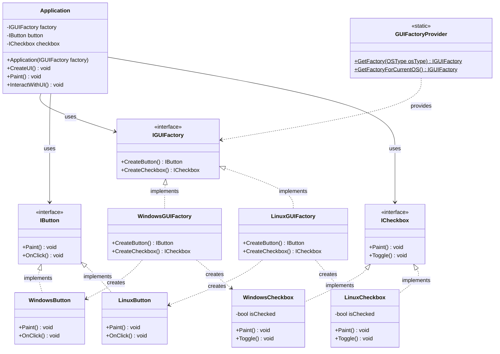

# Patrón Abstract Factory - Elementos de Interfaz de Usuario

## Descripción

Este proyecto implementa el patrón **Abstract Factory** en C# .NET 8.0 para crear elementos de interfaz de usuario (botones y checkboxes) específicos para diferentes sistemas operativos (Windows y Linux).

## ¿Qué es el Patrón Abstract Factory?

El patrón Abstract Factory proporciona una interfaz para crear familias de objetos relacionados o dependientes sin especificar sus clases concretas. Es útil cuando:

- El sistema debe ser independiente de cómo se crean sus productos
- El sistema debe configurarse con una de múltiples familias de productos
- Los productos de una familia están diseñados para trabajar juntos

## Estructura del Proyecto

```
InterfazUsuario/
├── Interfaces/
│   ├── IButton.cs           # Interfaz para botones
│   ├── ICheckbox.cs         # Interfaz para checkboxes
│   └── IGUIFactory.cs       # Abstract Factory
├── Windows/
│   ├── WindowsButton.cs     # Botón específico para Windows
│   ├── WindowsCheckbox.cs   # Checkbox específico para Windows
│   └── WindowsGUIFactory.cs # Fábrica para elementos de Windows
├── Linux/
│   ├── LinuxButton.cs       # Botón específico para Linux
│   ├── LinuxCheckbox.cs     # Checkbox específico para Linux
│   └── LinuxGUIFactory.cs   # Fábrica para elementos de Linux
├── Client/
│   └── Application.cs       # Cliente que usa la fábrica
├── Factory/
│   └── GUIFactoryProvider.cs # Proveedor de fábricas
└── Program.cs               # Programa principal
```

## Diagrama de Clases



## Componentes del Patrón

### 1. Abstract Factory (IGUIFactory)
Define la interfaz para crear familias de productos abstractos.

### 2. Concrete Factories
- **WindowsGUIFactory**: Crea elementos específicos para Windows
- **LinuxGUIFactory**: Crea elementos específicos para Linux

### 3. Abstract Products
- **IButton**: Interfaz para botones
- **ICheckbox**: Interfaz para checkboxes

### 4. Concrete Products
- **Windows**: WindowsButton, WindowsCheckbox
- **Linux**: LinuxButton, LinuxCheckbox

### 5. Client (Application)
Usa solo las interfaces abstractas, no depende de clases concretas.

## Ventajas del Patrón

1. **Aislamiento de clases concretas**: El cliente no necesita conocer las clases específicas
2. **Facilita el intercambio de familias de productos**: Cambiar de Windows a Linux es simple
3. **Consistencia entre productos**: Garantiza que los productos de una familia trabajen juntos
4. **Soporte para nuevas familias**: Agregar macOS sería fácil

## Cómo Ejecutar

1. Navega al directorio del proyecto
2. Ejecuta el proyecto:
   ```bash
   dotnet run
   ```

## Funcionalidades

La aplicación demuestra:

1. **Detección automática del SO**: Crea automáticamente la fábrica apropiada
2. **Selección manual**: Permite elegir qué tipo de interfaz crear
3. **Demostración interactiva**: Permite al usuario experimentar con diferentes tipos
4. **Renderizado específico**: Cada SO tiene su propio estilo visual
5. **Interacciones**: Simula clicks en botones y toggle de checkboxes

## Extensibilidad

Para agregar soporte para macOS:

1. Crear `MacOSButton` y `MacOSCheckbox` implementando las interfaces
2. Crear `MacOSGUIFactory` implementando `IGUIFactory`
3. Actualizar `GUIFactoryProvider` para incluir macOS
4. ¡No se requieren cambios en el código cliente!

## Conceptos Demostrados

- ✅ Abstract Factory Pattern
- ✅ Polimorfismo
- ✅ Inversión de dependencias
- ✅ Principio Abierto/Cerrado
- ✅ Separación de responsabilidades
- ✅ Factory Method (implícito en cada Create)
